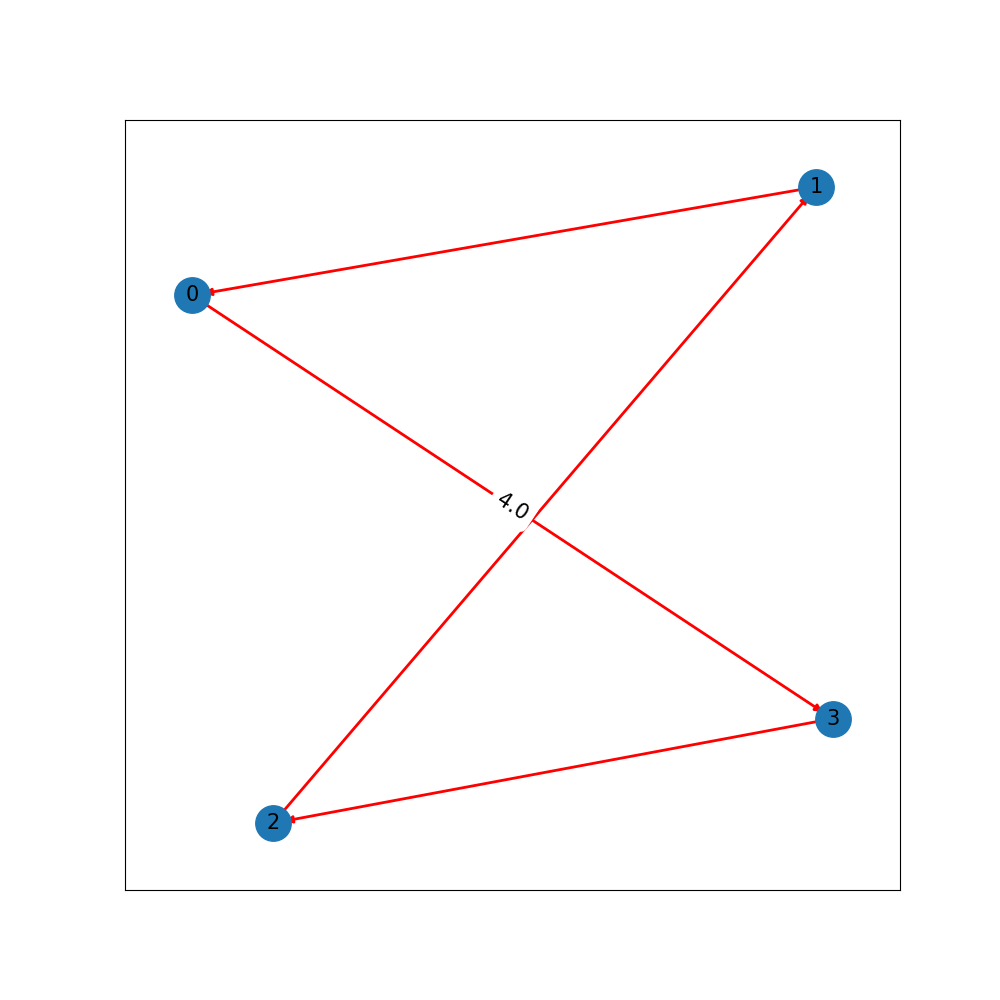
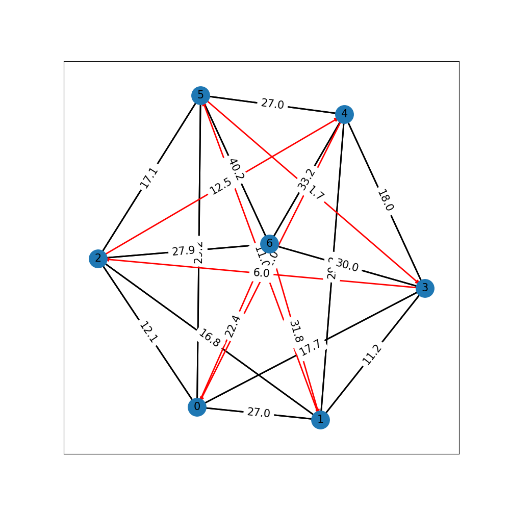
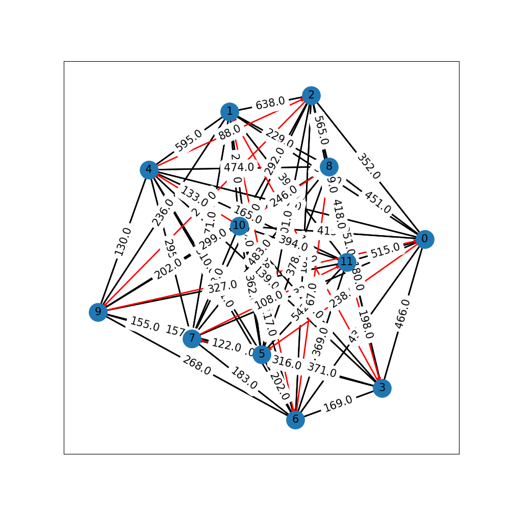
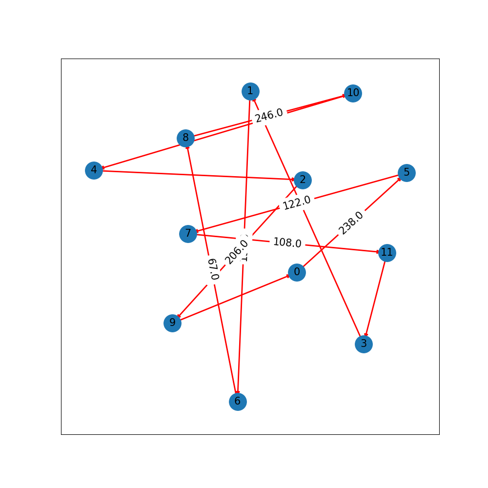

# Ant Colony Optimization - Sale Traveler Problem

**Colin Decourt - *AI Engineering Student Bordeaux INP - ENSEIRB MATMECA*** 

> This repository contain a code for a ant colony optimization applied to the Sale Traveler problem. This project was 
>realized as part of the 'Distributed Intelligence' and 'Research algorithms' courses given by Laurent Simon at 
>Bordeaux INP - ENSEIRB MATMECA. 

The following libraries must be install for running the code: 
* Numpy 
* NetworkX
* Matplotlib

## Description

The repository is composed of three files and one folder:
1. The *distances* folder contain distances matrices for solving
 the problem and the graph (general and solution) associated to these distances matrices. For examples with more than 15
 cities the graph visualization is difficult. 

2. `Ant.py` file contain a class for a ant. The class contain functions for finding the best path for each ant. This
class take a copy of the pheromone and visibility matrix of the world. 

3. `World.py` file is a class for finding the global best path using pheromones spread by all the ants. This class plots
the graph.  

## Usage

#### Run with default parameters 

 ``python main.py --distances distances/uk12_dist.txt --n-ite 20 --n-ants 12 --alpha 1 --beta 1 --ro 0.5``

We choose alpha = beta = 1 and ro = 0.5 because these parameters as knows as the bests. 

#### Custom run
 To run the code open a terminal and run: 
 
 ``python main.py --distances DISTANCES_PATH --n-ite NUM_ITE --n-ants N_ANTS --alpha ALPHA --beta BETA --ro RO``
 
 Parameters:
 * DISTANCES_PATH : the path of the wanted distance matrix
 * NUM_IT : the number of iterations the ant must done
 * N_ANTS : the number of ants. Generally N_ANTS = number of cities in the distance matrix
 * ALPHA : alpha value for transition choice
 * BETA : beta value for transition choice
 * RO : ro value for pheromone evaporation 

 ## Figures
 
 Best path is symbolizing by red arrows. 
 
 ##### Grid04 matrix
 
 All:
 
 
 
 Best: 
 
  

 ##### SH07 matrix
 
  All:
 
 
 
 Best: 
 
  
 
 ##### UK12 matrix
 
  All:
 
 
 
 Best: 
 
  